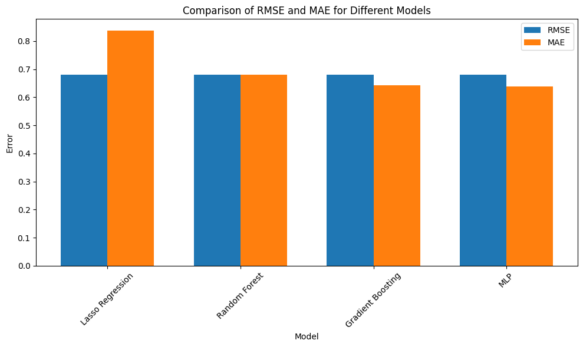
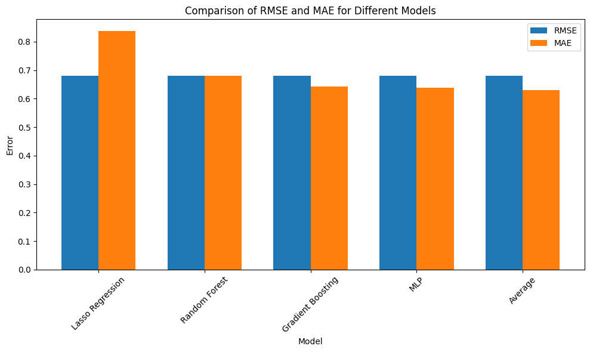
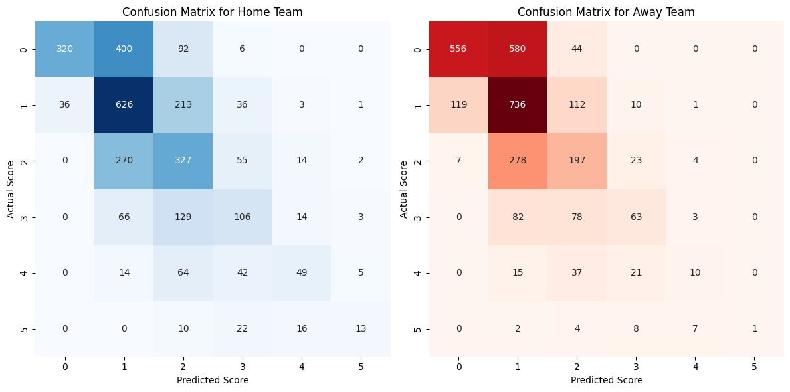
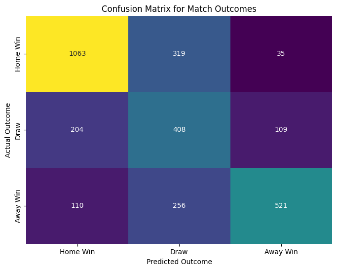
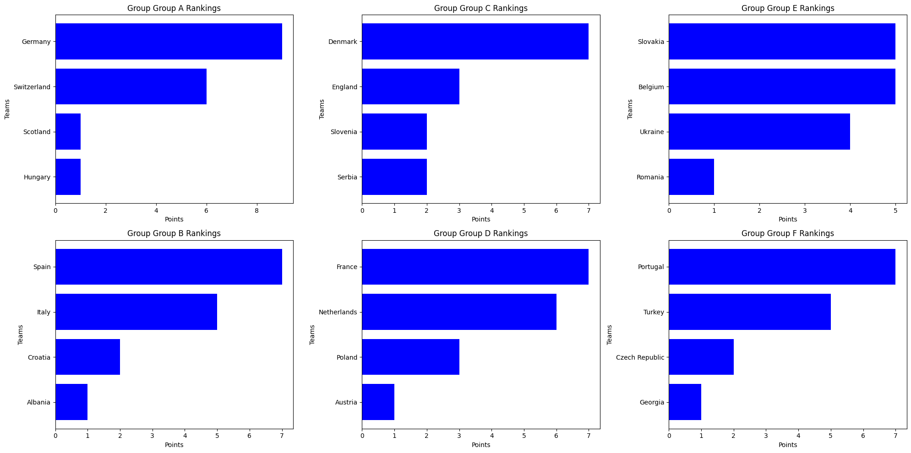
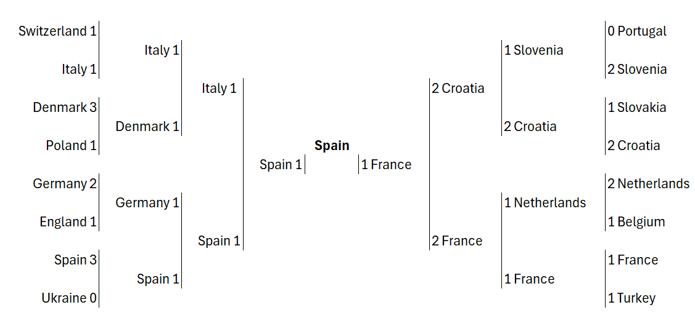

# Euro 2024 Winner Prediction

TL;DR: This project uses a Multi-Layer Perceptron (MLP) neural network to predict the winner of the Euro 2024 football tournament. 
According to the predictions, Spain wins the tournament, eliminating the host country Germany in the quarterfinals and the previous winner, Italy, in the semi-finals.

# Data
I utilize two different datasets for this project:

### International Football Results: 
This dataset includes international football results from 1872 up to today and is available [here](https://www.kaggle.com/datasets/martj42/international-football-results-from-1872-to-2017).
### FIFA World Rankings: 
This dataset contains previous and recent FIFA world rankings and is available [here](https://www.kaggle.com/datasets/cashncarry/fifaworldranking).

# Preprocessing and Feature Extraction

To ensure the relevance of the training data, I have only considered data from the last 20 years as this timeframe better reflects the current state of international soccer teams.
I used historical match results as the primary data source for feature extraction. The features can be broadly categorized into three groups:

1. Historical head-to-head comparisons
2. Momentum indicators
3. FIFA rankings

### Historical head-to-head comparisons:

For each pair of teams, features from their previous encounters are extracted. These characteristics include:
* Wins
* Losses
* Draws
* Goals scored
* Goals conceded
* Clean sheets

### Momentum indicators:

Momentum indicators reflect a team's recent performance. I have considered the same performance indicators as for the head-to-head comparisons for the last 5 matches of each team.

### FIFA Rankings

I have also integrated the FIFA rankings and the points on which these rankings are based. Besides the current and previous rank, I also consider the difference in rank for each game.

# Model Selection

To predict the results of the Euro 2024 matches, I tested several models to find the best solution and compared their performance basen on the Mean Absolute Error (MAE) and mean squared error (RMSE). The models tested include:

* Lasso regression
* Random forest
* Gradient Boosted Trees
* Multilayer perceptron (MLP)
  
### Model comparison
After training and testing each model on the dataset, I found that the performance metrics considered (MAE and RMSE) for Random Forest, Gradient Boosted Trees and MLP were quite similar, while this models seem to perform better than Lasso regression.

### Averaging the model predictions
Given the similar performance of these models, I also experimented with an averaging model that combines the predictions of MLP, Random Forest and Gradient Boosted Trees. However, this approach did not lead to a significant improvement in the performance.

Considering the slight edge in performance and the robustness of neural networks in capturing complex patterns, I decided to proceed with the Multi-Layer Perceptron (MLP) model for the final predictions.

### Accuracy metrics 

The confusion matrix below shows that most games end with two or fewer goals for each team, indicating that the model tends to accurately predict outcomes close to the actual results.

It is important to note that the misclassification of goals, as seen in the off-diagonal elements, is not as problematic as it may seem at first glance. Even if the model inaccurately predicts the exact number of goals scored, it may still correctly classify the match winner. Therefore, one should also consider the model's ability to correctly classify match outcomes. 

While the model achieved a prediction accuracy of 28.60% for the exact score, it correctly predicted the goal difference 39.90% of the time and the correct winner 65.85% of the time.

# Simulation
In the simulation, the group stage and the knockout phase are simulated slightly differently.

## Group Stage

* Matchday simulation: Each matchday is simulated separately. In this way, one can incorporate the results of the first matchday into the predictions for the second matchday and so on, ensuring that the key performance indicators are dynamically updated based on the latest results.
* Rounding of predictions: The predictions generated by the MLP model are floating point numbers. Since goals in soccer can only be natural numbers, these predictions are rounded to the nearest integer.
* Final group stage tables: After simulating all three match days, the final tables for the different groups are created. The results include the points, goal difference and goals scored by each team.
* Advancing teams: To determine which teams advance to the knockout stage, the top two teams from each group and the top four third-placed teams from all groups are selected. This selection process is based on the final table.

## Knockout Stage

* Constructing pairings: The first step is to create the exact pairings for the knockout stage. This task was somewhat challenging as the pairings depend on the specific groups from which the best third-placed teams come. I found a quick and dirty solution by manually determining all possible combinations of group placements for the third-placed teams.

* Round-by-round simulation: Once the pairings are finalized, I simulate each round of the knockout stage individually.

* Floating rate predictions: For each match in the knockout stage, I use the exact predictions of the model to determine the winner. This approach is necessary as with rounding to the nearest integer many matches end in a draw and therefore require the simulation of extra time or a penalty shootout.

* Fallback mechanism: In cases where the predicted goals are the same for both teams, the winner is drawn at random. However, this scenario is very unlikely and did not occur in my simulations.

# Results

## Group Stage

The final group stage results are summarized in the figure below. In most groups, the favorites managed to secure the top positions. Notably, England only placed second behind Denmark, accumulating just 3 points, which might come as a surprise to many.

## Knockout Stage

In the knockout phase, England and Portugal are eliminated early in the round of 16. England losses to hosts Germany, while Portugal is knocked out of the tournament by Slovenia.

Spain defeats Ukraine, Germany and the winner of 2020, Italy, before meeting France in the final. France reached the final round by beating Belgium, the Netherlands and Croatia. However, they lost to Spain in the final. In the end, Spain emerges as the winner of the EURO 2024.

The specific results are as follows:

